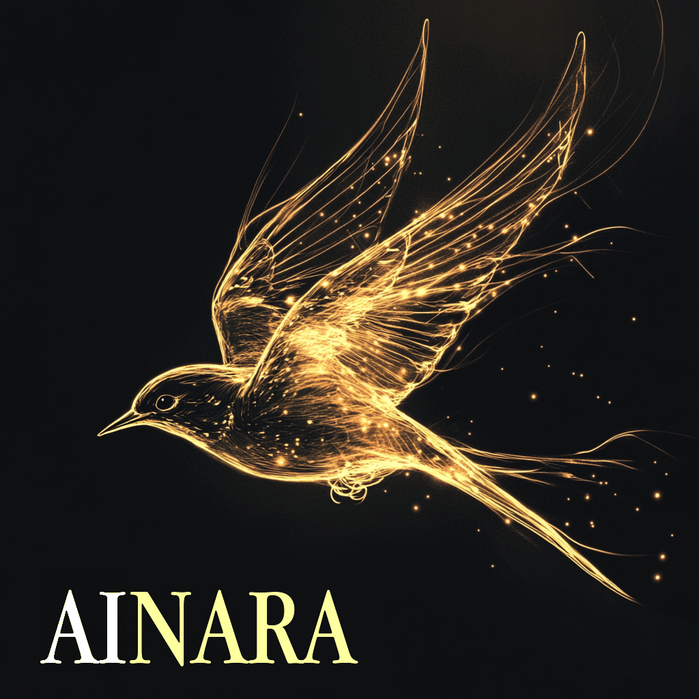

# Ainara AI Assistant Framework



**Ainara** _/aɪˈnɑːrə/ (n.) [Basque origin]: 1. A feminine given name meaning "swallow" (the bird) or "beloved one". [..] Associated with spring, and the beginning of life._
<br><br>


Ainara is a (work-in-progress) modular AI assistant framework that combines local LLM capabilities with extensible skills. It consists of multiple components that work together to provide a flexible and powerful AI interaction system.

## Demonstration video

UPDATE February 24th, 2025: This is the 7th video in my series featuring Ainara, and the 2nd featuring the desktop client, Polaris. It features a new local file search skill, a minimalisty typing functionality, and behind the scenes a new LLM based skill matcher much more effective determining the user intent.

An important aspect to highlight in this video: I'm not using any commercial LLM backend, but rather running llama.cpp with a 5-bit quantized version of Qwen 2.5 14B on my own server, which features a 'humble' NVidia RTX 3060 card. I'm quite impressed by how well it understands the instructions to interact with my local Orakle server, as demonstrated in this video.

[](https://www.youtube.com/watch?v=mBimxZjGlWM)

## $AINARA Token

The Ainara Project has now it's own Solana cryptocurrency token, CA: HhQhdSZNp6DvrxkPZLWMgHMGo9cxt9ZRrcAHc88spump

While the project will always remain open-source and aims to be a universal AI assistant tool, the officially developed _skills_ (allowing AI to interact with the external world through Ainara's Orakle server) will primarily focus on cryptocurrency integrations. The project's official token will serve as the payment method for all related services.

## Components

### Orakle
A REST API server that provides:
- Extensible skills system
- Recipe workflow execution
- Web content processing
- News search capabilities
- Text processing with LLMs

### Kommander
A CLI chat interface that connects to local/commercial LLM servers and the Orakle API server. Features:
- Interactive chat with AI models
- Support for multiple LLM providers
- Command execution through Orakle API
- Chat history backup
- Light/dark theme support
- Pipe mode for non-interactive use

### Polaris
A modern desktop-integrated application that provides:
- Native integration with system features
- Intuitive, minimalistic AI interaction interface
- Rich graphical interface for chat interactions
- Real-time skill execution feedback
- System tray presence for quick access
- Cross-platform support (Linux, Windows, macOS)


## Installation

1. Clone the repository:
```bash
git clone https://github.com/yourusername/ainara.git
cd ainara
```

2. Install dependencies:
```bash
pip install -r requirements.txt
# Download required NLTK data
python setup_nltk.py
```

## Usage

### Starting Kommander CLI

Basic usage:
```bash
./kommander/kommander
```

Options:
- `-l, --light`: Use colors for light themes
- `-m, --model MODEL`: Specify LLM model
- `-s, --strip`: Strip everything except code blocks in non-interactive mode
- `-h, --help`: Show help message

You can also pipe input for non-interactive use:
```bash
echo "What is 2+2?" | ./kommander/kommander
```

### Environment Variables

- `AI_API_MODEL`: Override default LLM model

## Requirements

- Python 3.8+
- Dependencies listed in requirements.txt
- Local LLM server (compatible with OpenAI API format)
- Orakle API server running locally or on network

## License

Dual-licensed under [LGPL-3.0](LICENSE.LGPL) (open source) and commercial terms (contact [email](mailto:rgomez@khromalabs.org))

## Contributing

Everyone's invited to join this project - developers, designers, sponsors, testers, and more! My ultimate goal would be to create an open, community-driven AI companion/assistant that achieves for the emerging open source AI tools what Linux did for Unix: a widely adopted, powerful, and endlessly customizable assistant that empowers users and developers alike.
